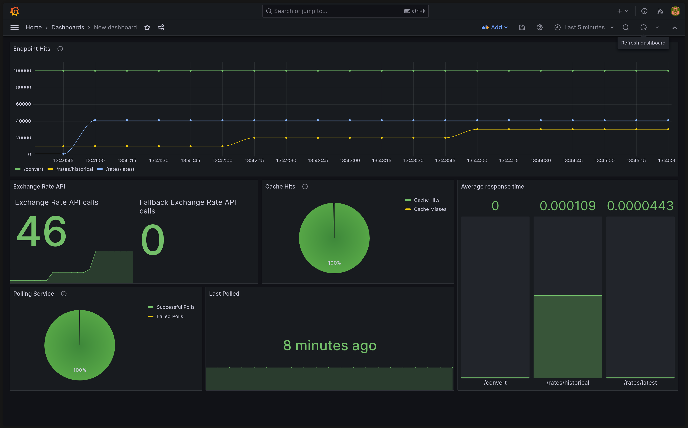

# Forex Exchange Rate API with Prometheus & Grafana

This project is a **Go-based Forex exchange rate service** with real-time metrics exposed via **Prometheus** and visualized in **Grafana**.  
It supports retrieving the latest rates, historical data, and currency conversions.

## Features
- REST API for:
  - Latest Forex rates
  - Historical Forex rates over a time range
  - Currency conversion
- Metrics for:
  - Request counts
  - Error counts
  - Request duration histograms
- Dockerized deployment for:
  - **Go API**
  - **Prometheus**
  - **Grafana**
  - **Redis**
- Configurable via `.env` file

---

## Project Structure
```bash
.
├── cache/                   # In-memory caching
├── cmd/                     # Application entry point
├── handlers/                # HTTP request handlers
├── metrics/                 # Prometheus metrics definitions
├── models/                  # Data models
├── services/                # Business logic & integrations
├── prometheus.yml           # Prometheus configuration
├── docker-compose.yml       # Orchestrates services
├── dockerfile               # Builds the Go app
├── go.mod / go.sum          # Go module dependencies
├── .env                     # Set environment variables
└── .gitignore               # Git ignore rules
```

## Setup & Installation

### 1. Clone the repository
```bash
git clone https://github.com/Radheshg04/GreedyGame.git
cd GreedyGame
```

### 2. Configure environment variables

Create a `.env` file in the project root with the required variables:  

```bash
EXCHANGE_RATE_API_KEY="FOREX_API_KEY"
EXCHANGE_HOST_API_KEY="FALLBACK_API_KEY"
```

### Where to get them:

 - Sign up for a free account at ExchangeRate API [here](https://www.exchangerate-api.com/). Get an API key from the dashboard after signing in.

 - For the fallback API, register at ExchangeRates.host [here](https://exchangerate.host/). 

Paste the obtained keys into the .env file in the project root.

### 3. Build and start the containers

```bash
docker compose up --build
```

This will start:

**Go API (port 8080)**

**Prometheus (port 9090)**

**Grafana (port 3000)**

**Redis (port 6379)**

### 4. Access the services
- **API**: [http://localhost:8080](http://localhost:8080)
- **Prometheus**: [http://localhost:9090](http://localhost:9090)
- **Grafana**: [http://localhost:3000](http://localhost:3000) (login: `admin` / pass: `admin`)

---

## Monitoring & Metrics

### Prometheus
Prometheus scrapes metrics from the Go service at:
```bash
http://go_app:2112/metrics
```

### Grafana

1. Open Grafana at [http://localhost:3000](http://localhost:3000).
2. Add Prometheus as a data source:
   - **URL**: `http://prometheus:9090`
   - **Access**: `Server`
3. Import dashboards or create custom ones.

---

## API Endpoints

| Method | Endpoint              | Query Parameters                                                                                       | Description                                                                                       |
|--------|-----------------------|--------------------------------------------------------------------------------------------------------|---------------------------------------------------------------------------------------------------|
| GET    | `/rates/latest`       | None                                                                                                   | Get the latest exchange rates for all supported currencies.                                       |
| GET    | `/rates/historical`   | `currency1` (string) — Base currency <br> `currency2` (string) — Target currency <br> `from` (YYYY-MM-DD) — Start date <br> `to` (YYYY-MM-DD) — End date | Get historical exchange rates for a currency pair over a specified time range.                   |
| GET    | `/convert`            | `from` (string) — Base currency <br> `to` (string) — Target currency <br> `date` (YYYY-MM-DD, optional) — Historical date | Convert between currencies. If `date` is provided, returns the historical conversion rate; otherwise, returns the current rate. |

## Assumptions
- Supports only: USD, INR, EUR, JPY, GBP.
- Latest rates are refreshed every 1 hour and cached in memory to reduce API calls.
- Fallback API is used only when the primary API fails.
- Historical data is only available for the last 90 days. Requests beyond that return an error.


## Example Requests

### Get Latest Rates
```bash
curl -X GET 'http://localhost:8080/rates/latest'
```
#### Expected Output:
```json
{
  "EUR": 0.85529477,
  "GBP": 0.73664008,
  "INR": 87.54853587,
  "JPY": 146.63268885,
  "USD": 1
}
```

### Convert Currencies (Current)
```bash
curl -X GET 'http://localhost:8080/convert?from=USD&to=INR'
```

#### Expected Output:
```json
{
  "amount": 87.54853587
}
```

### Convert Currencies (Historical)
```bash
curl -X GET 'http://localhost:8080/convert?from=USD&to=INR&date=2025-08-10'
```

#### Expected Output:
```json
{
  "amount": 87.6119484
}
```

### Get Historical Rates
```bash
curl -X GET 'http://localhost:8080/rates/historical?currency1=USD&currency2=INR&from=2025-08-10&to=2025-08-14'
```

#### Expected Output:
```json
{
  "conversion rates": [
    87.6119484,
    87.66770623,
    87.67856445,
    87.68494592,
    87.54853587
  ]
}
```

## Bonus
- Integrated Prometheus metrics and Grafana dashboards for real-time monitoring.

### To import the provided dashboard:

    1. Go to Grafana → Dashboards → Import
    2. Upload `grafana-dashboard.json` from 'examples' folder in this repo.
    3. Select the Prometheus data source and click Import.




## Stopping the services
```bash
docker compose down
```

